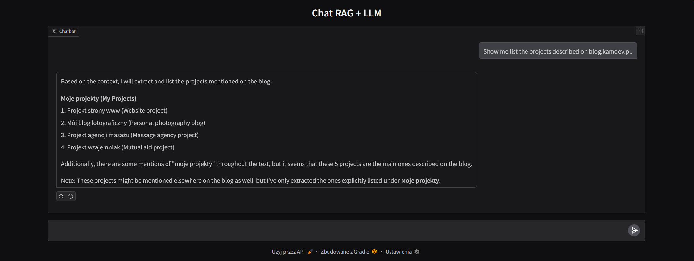

# Chroma-RAG with OpenAI & Local Providers (Ollama)

This project integrates a Retrieval-Augmented Generation (RAG) model with Chroma, a vector database, to perform efficient and scalable search and generation tasks. You can run the system with either OpenAI's embeddings or a local embedding provider to process and retrieve relevant information from your data.

Key Features:
- Embedding Import: Import your data using embeddings into Chroma for quick and efficient search.
- Search & Query: Query the Chroma database to find the most relevant embeddings and pass them to the Large Language Model (LLM) model for generating detailed answers.
- Local vs. OpenAI Providers: Choose between local providers (e.g., Ollama) or OpenAI's API for different use cases and performance needs.
- Interactive GUI: Launch a user-friendly interface with Gradio to interact with the system easily.


## Tutorial  [PL] 

All code and content are authored by me.

Stay tuned for the upcoming parts of my [RAG tutorial series](https://blog.kamdev.pl).

### Available Parts

- **Part 1:** [Import danych do bazy wektorowej](https://blog.kamdev.pl/post/budujemy-wlasny-rag-cz-1-import-danych-do-bazy-wektorowej/)

- **Part 2:** [Przeszukiwanie bazy wektorowej](https://blog.kamdev.pl/post/budujemy-wlasny-rag-cz-2-przeszukiwanie-bazy-wektorowej/)

- **Part 3:** [Tworzymy gui do naszego chat-a + >bonus< scrapowanie stron www](https://blog.kamdev.pl/post/budujemy-wlasny-rag-cz-3-dodajemy-gui-oraz-scrapowanie-stron-www/)

## Install
```
python -m venv .venv
source .venv/bin/activate
pip3 install -r requirements.txt
cp .env_dist .env # Enter your OpenAI key
```

## Run

### Run with Local Embedding Provider and Ollama Instance

Imports data using embeddings into Chroma.
```
python console.py --embedder_provider local --import --verbose
```

Searches for similar embeddings in Chroma and passes them to the RAG.
```
python console.py --search_provider local --embedder_provider local --verbose --query "Show me list the projects described on blog.kamdev.pl."
```

Sample output
```
Based on the context, here are the projects listed on the blog kamdev.pl:
1. Projekt strony www (Web Project)
2. Blog fotograficzny (Photography Blog)
3. Projekt agencji masażu (Massage Agency Project)
4. Projekt wzajemniak (Unknown/ Private Project)
And also, the blog mentions a portfolio section, where you can find more projects.                                                      
```

### Run with OpenAI Provider (Embedding & API)

Imports data using embeddings into Chroma.
```
python console.py --embedder_provider openai --import --verbose 
```

Searches for similar embeddings in Chroma and passes them to the RAG.
```
python console.py --search_provider openai --embedder_provider openai --verbose --query "Show me list the projects described on blog.kamdev.pl."
```

Sample output
```
The projects described on the blog kamdev.pl include: 
1. Profesionalne strony www    
2. Mój blog fotograficzny 
3. Projekt agencji masażu
4. Projekt wzajemniak
5. Agencja detektywistyczna
```

### Run GUI with Gradio

Starts the GUI with Gradio for easier interaction.
```
python gui.py --embedder_provider local --verbose
python gui.py --embedder_provider openai --verbose
```


